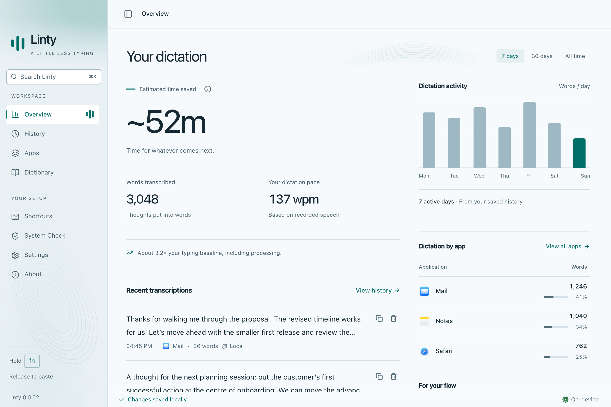

<p align="center">
  
</p>
<h1 align="center">Linty</h1>
<p align="center"><strong>Privacy first. Your voice, your Mac, your words.</strong><br />Free, on-device dictation for macOS. Hold a key, speak, release to paste.</p>

<p align="center">
  <!-- dmg-downloads:start -->
  <a href="https://github.com/shekhardtu/linty/releases"></a>
  <!-- dmg-downloads:end -->
  <a href="https://github.com/shekhardtu/linty/releases/latest"></a>
  <a href="https://github.com/shekhardtu/linty/actions/workflows/checks.yml"></a>
  <a href="LICENSE"></a>
  
</p>
<p align="center">
  <a href="https://github.com/shekhardtu/linty/releases/latest/download/linty.dmg"><strong>Download for Mac</strong></a> ·
  <a href="https://linty.ai">Website</a> ·
  <a href="#measured-performance">Benchmarks</a> ·
  <a href="SUPPORT.md">Get help</a> ·
  <a href="#build-with-me">Contribute</a>
</p>

## Install and start dictating

| Platform | Status |
|---|---|
| macOS 14+ on Apple Silicon (M1 or newer) | Supported; download the universal `.dmg` |
| macOS 14+ on Intel | Supported by the same universal `.dmg`; Whisper dictation and CPU cleanup |
| Windows / Linux / iOS / Android | No supported application build currently provided |

1. [Download Linty for Mac](https://github.com/shekhardtu/linty/releases/latest/download/linty.dmg) — the installer downloads directly.
2. Open it and drag **Linty** into **Applications**.
3. Launch Linty. English and **Right Command (⌘)** are already selected, and local speech support prepares automatically. Guided setup is optional.
4. Grant **Microphone** and **Accessibility** access in System Check and wait for the initial downloads to finish.
5. Open a text field in another app, hold **Right Command**, speak, and release to paste. You can also try a recording in System Check. Change languages in **Settings → Dictation** or choose another trigger in **Shortcuts**.

Official releases are Developer ID signed and notarized by Apple. Dictation needs no account, API key, or subscription.

| Available engine | Processing | Accelerator | Initial model download |
|---|---|---|---|
| **Parakeet TDT v3 (0.6B)** | Offline after download | CoreML / Apple Neural Engine via FluidAudio | About 500 MB, as estimated in the app |
| **Whisper Large v3 Turbo Q5** | Offline after download | Metal via whisper.cpp | About 574 MB |

English also prepares on-device text cleanup (about 496 MB). Choose **Keep as spoken** in Settings → Dictation to turn cleanup off.

[Installation and troubleshooting help](SUPPORT.md)

Download estimates describe disk transfer, not RAM requirements. Available memory, language, background noise, and microphone quality affect results. Additional Parakeet dictionary assets may be downloaded when vocabulary support is enabled.

## The app

<picture>
  <source media="(prefers-color-scheme: dark)" srcset="website/images/overview-dark.png" />
  
</picture>
<p align="center"><sub>Actual interface with illustrative data. Estimated time saved uses a 40 wpm typing baseline.</sub></p>

- **Native menu bar controls:** switch microphone and language without opening the main window.
- **Local history:** search, edit, and copy past transcriptions. By default, entries stay until you delete them; optional retention settings are available, and there is no 500-entry cap.
- **Personal dictionary:** keep names and technical terms close to the transcription workflow.
- **Overview:** see activity, app usage, and estimated time saved.
- **Configurable shortcuts and recording feedback:** dictate into the apps you already use.

## Privacy first

Read the [privacy notice](PRIVACY.md) and [license and responsible use](TERMS.md), also included offline in the app.

- **Local speech recognition keeps audio on your Mac.** Once a model is downloaded, speech recognition works offline.
- **Speech recognition, text cleanup, and history stay local.** Read the [history storage](docs/HISTORY-STORAGE.md) details.
- **Saving recordings is opt-in.** Enable “Save dictation audio” in Privacy & storage for local History playback and WAV export. Recordings follow history retention and deletion. This does not authorize sharing, training, or automatic evaluations. See the [audio privacy policy](docs/AUDIO-PRIVACY.md).
- **Downloads and updates use the network.** Model hosts and GitHub receive connection metadata. Website hosting is separate from app processing; see the [website disclosure](PRIVACY.md#website-and-github).
- **No app usage telemetry.** Linty does not send app usage analytics. Downloads and update checks still connect to GitHub.

The download badge counts only `.dmg` installer downloads across all published GitHub releases, including older filenames and prereleases. It excludes updater archives, signatures, and metadata. This is a dated snapshot of downloads, not a count of unique users; [view the snapshot](website/downloads.json).

<details>
<summary>Technical comparisons and measured performance</summary>

## How Linty compares

Privacy first means you can dictate without sending your speech to a server. Linty keeps local engines, history, and the source code in your control. Other tools offer different platform coverage and workflows:

| | **Linty** | **VoiceInk** | **Superwhisper** | **Wispr Flow** |
|---|---|---|---|---|
| Offline speech recognition | Whisper Turbo Q5 and Parakeet TDT v3 | Local models | Local Whisper and Parakeet options | Requires an internet connection |
| Desktop availability | macOS 14+, Intel and Apple silicon | macOS | macOS and Windows | macOS and Windows |
| Source / access | **MIT; free app and source** | GPL-3.0 source; paid packaged app | Free tier and paid Pro | Free tier and paid plans |
| Build or modify the app yourself | Yes | Yes | Use the vendor's app | Use the vendor's app |

Comparison checked **20 September 2026** against the projects' own documentation: [VoiceInk source](https://github.com/Beingpax/VoiceInk) and [product details](https://tryvoiceink.com), [Superwhisper models](https://superwhisper.com/models) and [downloads](https://superwhisper.com/download), [Wispr Flow requirements](https://docs.wisprflow.ai/articles/1036674442-supported-devices-and-system-requirements) [internet requirement](https://docs.wisprflow.ai/articles/4048537120-what-to-expect-from-flow-accuracy-and-known-limitations), and [plans](https://wisprflow.ai/pricing). This is a feature comparison, not a head-to-head speed or accuracy benchmark. Features and plans can change.

## Measured performance

**Thirty-minute audio file → 4.97 seconds with Parakeet, 96.62 seconds with Whisper Turbo Q5** in our repeat-inference test.

Measured **16 September 2026** on **Apple M3 Pro, 18 GiB unified memory, 11 CPU cores, macOS 26.5**, connected to power. The corpus is synthetic English with pauses, processed directly from WAV files. Models were already downloaded; these are inference timings, excluding model loading, recording time, the UI, and paste.

| Audio length | Parakeet TDT v3 | Whisper Large v3 Turbo Q5 |
|---|---:|---:|
| 1 minute | 0.22 s | 3.63 s |
| 5 minutes | 0.88 s | 16.43 s |
| 10 minutes | 1.72 s | 32.19 s |
| 20 minutes | 3.30 s | 63.82 s |
| 30 minutes | **4.97 s** | **96.62 s** |

**Process resources during the 30-minute file test:**

| Measurement | Parakeet TDT v3 | Whisper Turbo Q5 |
|---|---:|---:|
| Average CPU during repeat inference | 365.4% | 5.8% |
| Sampled peak CPU, including model loading | 402.1% | 474.3% |
| Peak resident memory (RSS) | 352.4 MiB | 968.1 MiB |
| Peak physical footprint | 264.4 MiB | 950.5 MiB |
| Neural Engine footprint, reported separately | 467.7 MiB | — |
| Word error on this synthetic 30-minute file | 0.37% | 2.16% |

CPU uses macOS's convention: **100% = one fully occupied core**. Whisper uses Metal; its low CPU average does not describe GPU utilization or power consumption. Memory figures cover the benchmark process, not the complete app and system. Neural Engine and process memory use different accounting rules; do not sum the columns.

These are single repeat runs on one machine, not typical-user latency or accuracy guarantees. Model loading can add time: the initial Parakeet load in this suite took 15.83 seconds. Both engines completed files up to 30 minutes, but this does not certify a 30-minute live microphone session. Long recordings remain in memory until stopped; there is no fixed recording-duration cutoff.

[Full methodology and limitations](docs/TRANSCRIPTION-CAPACITY.md) · [Raw CSV](docs/benchmarks/capacity-m3-pro-2026-09-16.csv) · [Quality regression results](docs/TRANSCRIPTION-GUARDS.md)

</details>

## Build from source

Use macOS 14+ on Intel or Apple silicon, **Xcode 16+ with its command-line tools selected**, stable Rust, Node.js 24+, and Yarn 1.x. Parakeet runs on Apple silicon and requires the full Xcode toolchain. Intel uses Whisper and S1-mini on CPU.

Install both Rust targets with `rustup target add aarch64-apple-darwin x86_64-apple-darwin`. `yarn build:mac` creates one universal installer at `release/linty.dmg`; use `yarn build:mac --unsigned` for a local test build without signing credentials. Official releases are built on Apple silicon using the [local release runbook](docs/runbooks/local-releases.md).

```bash
git clone https://github.com/shekhardtu/linty.git
cd linty
yarn install --frozen-lockfile
yarn tauri dev --features local-stt,parakeet
```

The first native build downloads dependencies and compiles both engines. `yarn dev` runs only the frontend. You do not need the maintainer's signing credentials to run development mode.

```bash
yarn test
yarn build
cd src-tauri
cargo fmt --check
cargo check --features local-stt,parakeet
```

Built with **Tauri 2 + Rust + React**, [whisper.cpp](https://github.com/ggml-org/whisper.cpp) through whisper-rs, and [FluidAudio](https://github.com/FluidInference/FluidAudio). See [Development setup](docs/DEV-SETUP.md) for release signing and architecture. Third-party engines and models retain their own licenses. The app bundles [dependency notices](src-tauri/licenses/THIRD_PARTY_NOTICES.txt) and [model attribution](src-tauri/licenses/MODELS.md).

Each release includes customer-facing improvements in `RELEASE_NOTES.md`, shared by the app, updater feed, and GitHub release. See the [release runbook](docs/runbooks/releases.md) before merging a release change.

## Build with me

Linty is built around **privacy first** and useful local software. Contributions are welcome to make dictation better.

Contributions that would make a difference:

- Test real speech across accents, languages, microphones, and different Macs; share reproducible, consented samples and measurements.
- Improve long-recording recovery, reduce memory use, and measure full-app latency and battery cost.
- Improve keyboard navigation, VoiceOver support, and the everyday recording experience.
- Explore new local engines and platform support, or propose something we haven't thought of.

[Read the contributor guide](CONTRIBUTING.md) · [Find an issue](https://github.com/shekhardtu/linty/issues) · [Start a discussion](https://github.com/shekhardtu/linty/discussions) · [Connect with me on GitHub](https://github.com/shekhardtu)

If Linty is useful to you, **star the repository** so more people can find it. A clear bug report, documentation fix, or thoughtful idea is a contribution too.

## Support, security, and license

[Report a bug or request a feature](https://github.com/shekhardtu/linty/issues/new/choose). Remove private transcription text and credentials from reports. Use [private vulnerability reporting](https://github.com/shekhardtu/linty/security/advisories/new) for security issues; see [SECURITY.md](SECURITY.md).

Linty is licensed under [MIT](LICENSE).
