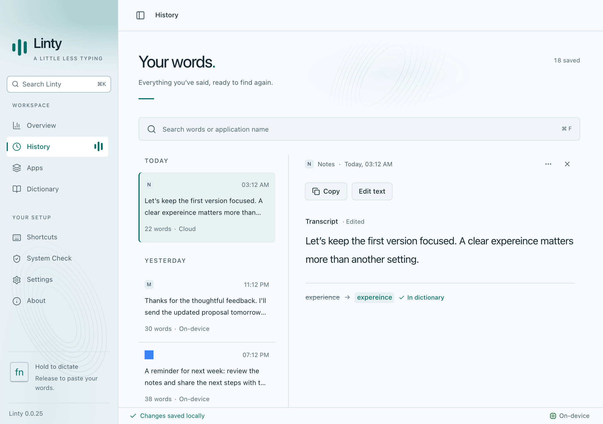
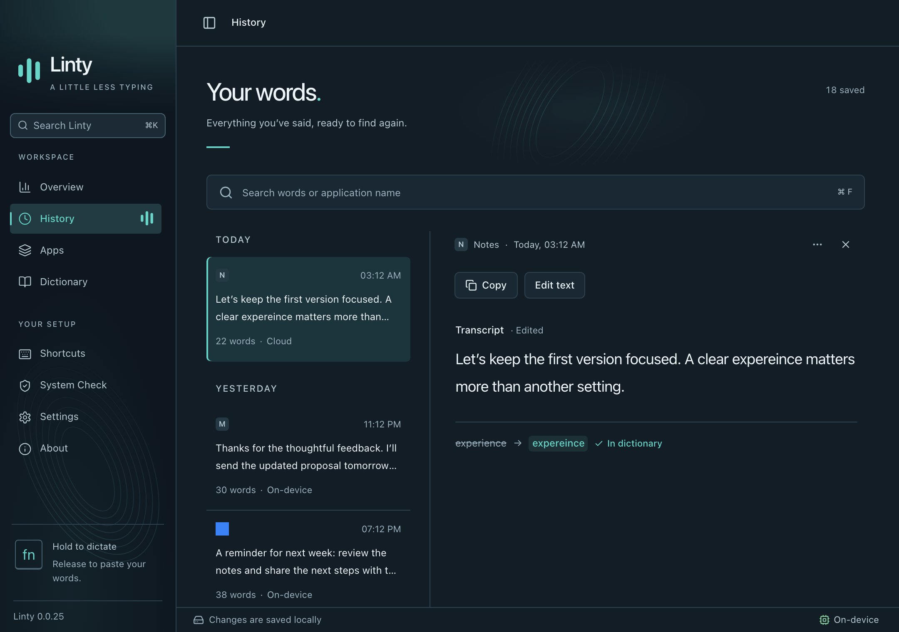
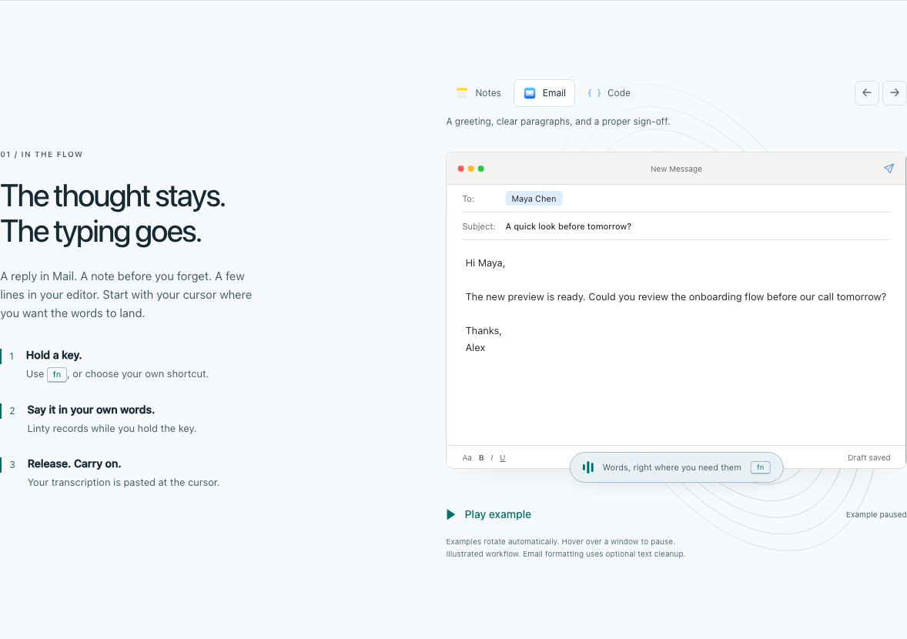
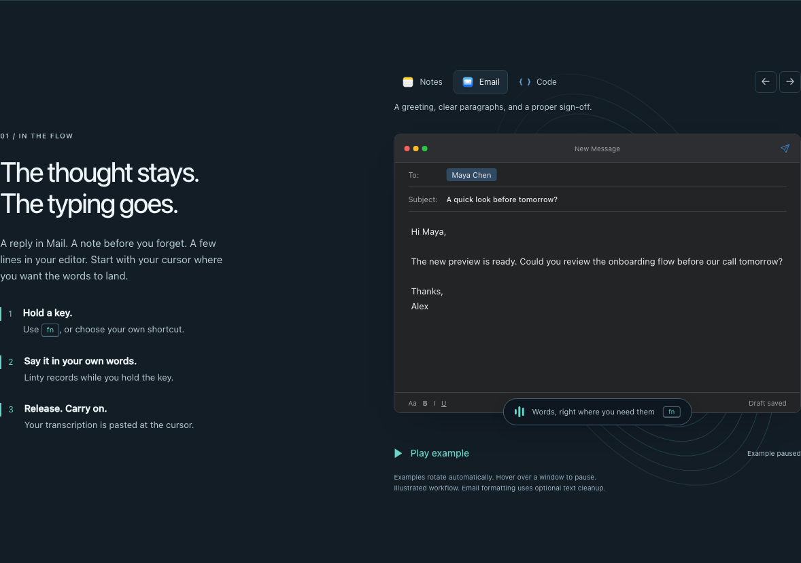

# Combined change review — September 18, 2026

Reviewed the complete onboarding, dictation preparation, speech gate, hands-free
capture, transcript Details, and website change set for PR #61. Review fixes:

- Close the native Details dialog before unmounting it to restore keyboard focus immediately.
- Reject tray language changes while dictation is busy and reject unsupported language codes.
- Make UI tests poll synchronous state predicates. Promise-valued predicates could finish before the required state; preparation tests now exercise two completed synthetic pastes.
- Update the usability assertions for the new capsule's status announcements.
- Correct website definition-list markup and illustration label contrast. Refresh the changed asset hashes.
- Include all website unit tests in the normal CI test command.

## Validation

All commands passed on the final relevant sources:

| Check | Result |
| --- | --- |
| `yarn build` | TypeScript, generated icons, Vite build passed |
| `yarn test` | 73 tests passed |
| Native release build with `local-stt,parakeet` | Passed |
| Native release library tests, including the installed S1 model test | 56 passed, none skipped |
| Native library check without default features | Passed |
| Swift release tests with the cached detector and quiet speech fixture | 3 passed, none skipped |
| UI smoke, dictation, transcript Details, recovery | Passed in Chromium and WebKit |
| UI preparation and onboarding | Passed in Chromium |
| Motion and usability | Passed in Chromium, including light/dark and reduced motion |
| Website browser review | Chromium/WebKit, light/dark, all three demo scenes, mobile width, WCAG A/AA checks, asset contents and version hashes passed |
| Rust logging hygiene and `git diff --check` | Passed |

The [saved native preparation report](../../benchmarks/dictation-prewarm-2026-09-18.json)
records unchanged transcription text/errors across 651 fixtures. Those native
speech paths were unchanged during this PR review; they were not rerun as a
651-case benchmark during the review. Browser tests use synthetic data and mock
Tauri IPC. Native model tests exercise actual installed assets, but this review
does not claim a live microphone or packaged-app end-to-end trial.

Remaining tradeoffs are documented in [dictation readiness](../../DICTATION-READINESS.md),
[the speech evaluation](../../VAD-EVALUATION-2026-09-18.md), and
[the dictation pill](../../DICTATION-PILL.md): startup/idle preparation costs and
resident model memory; some remaining noise hallucinations and existing short
speech ASR errors; and an inactivity heuristic that can mistake sufficiently
faint or uniform input for silence. No unresolved blocking review findings remain.

## Synthetic UI evidence

| Surface | Light | Dark |
| --- | --- | --- |
| History |  |  |
| Quiet-input warning |  |  |
| Website example |  |  |
