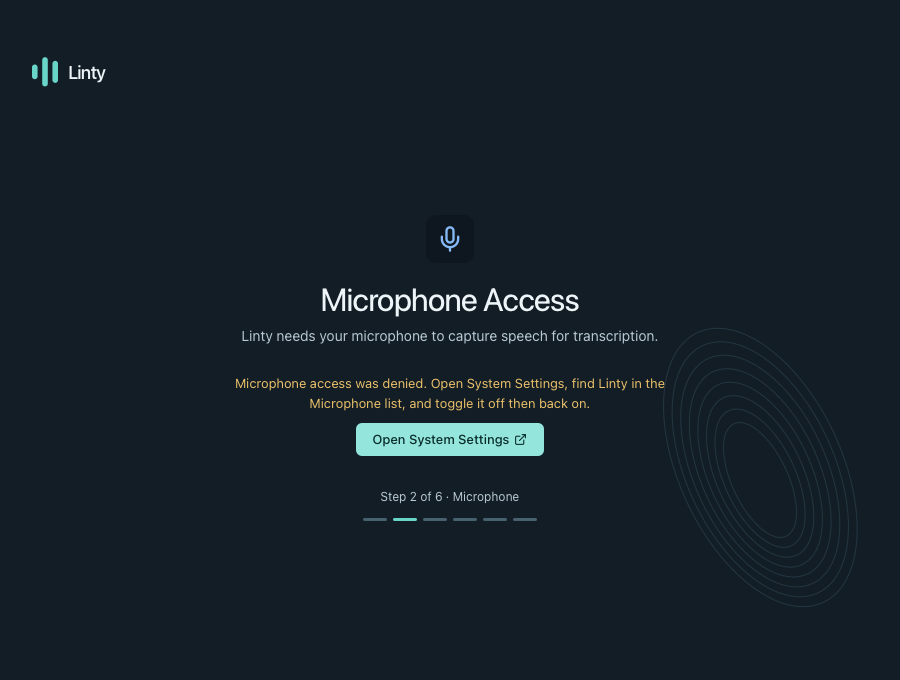
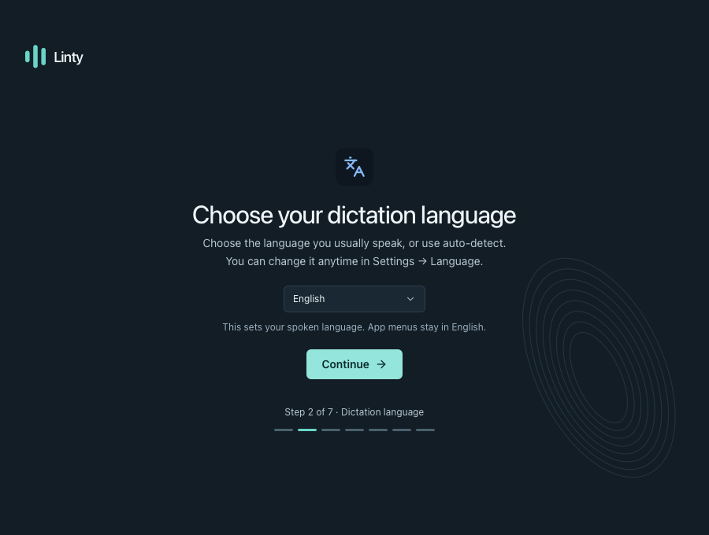
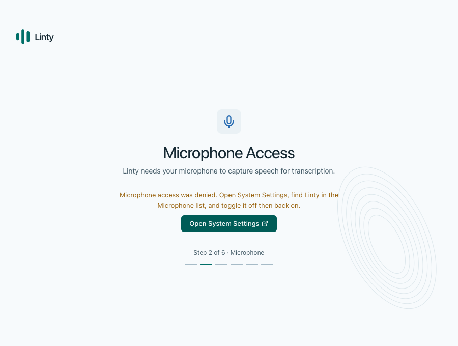
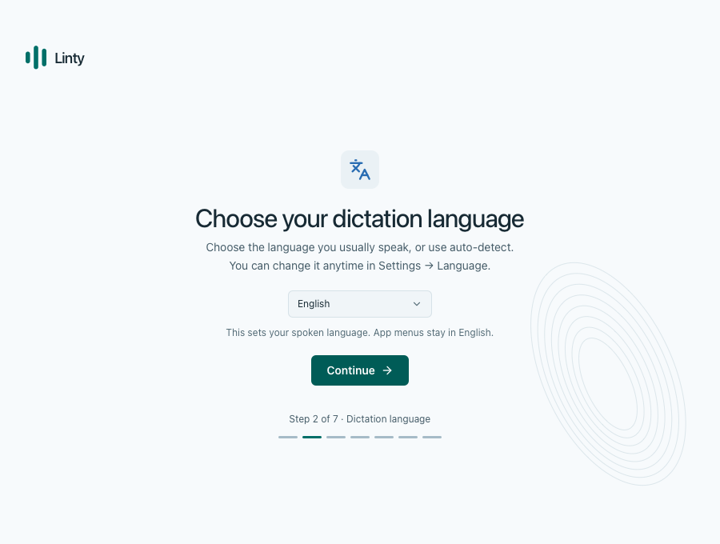
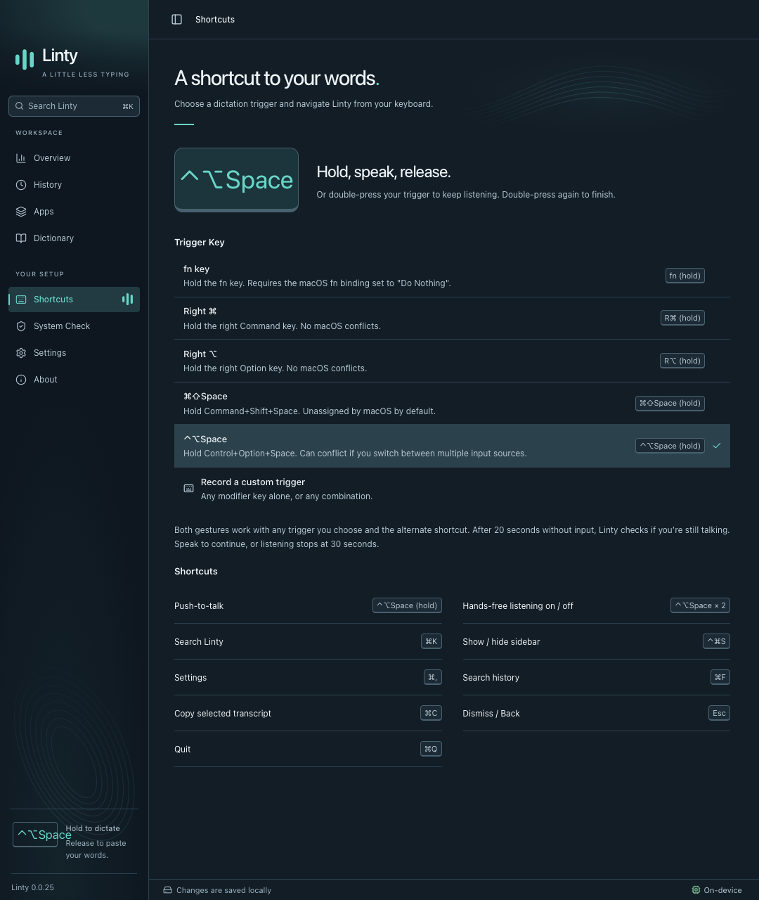
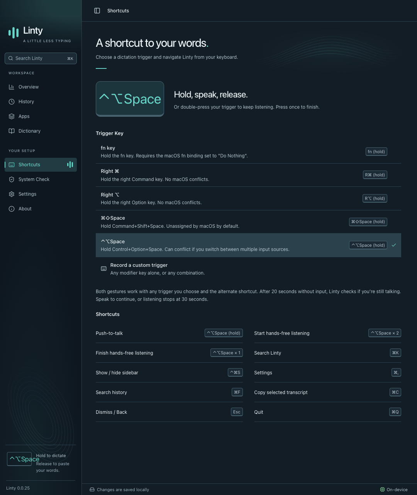
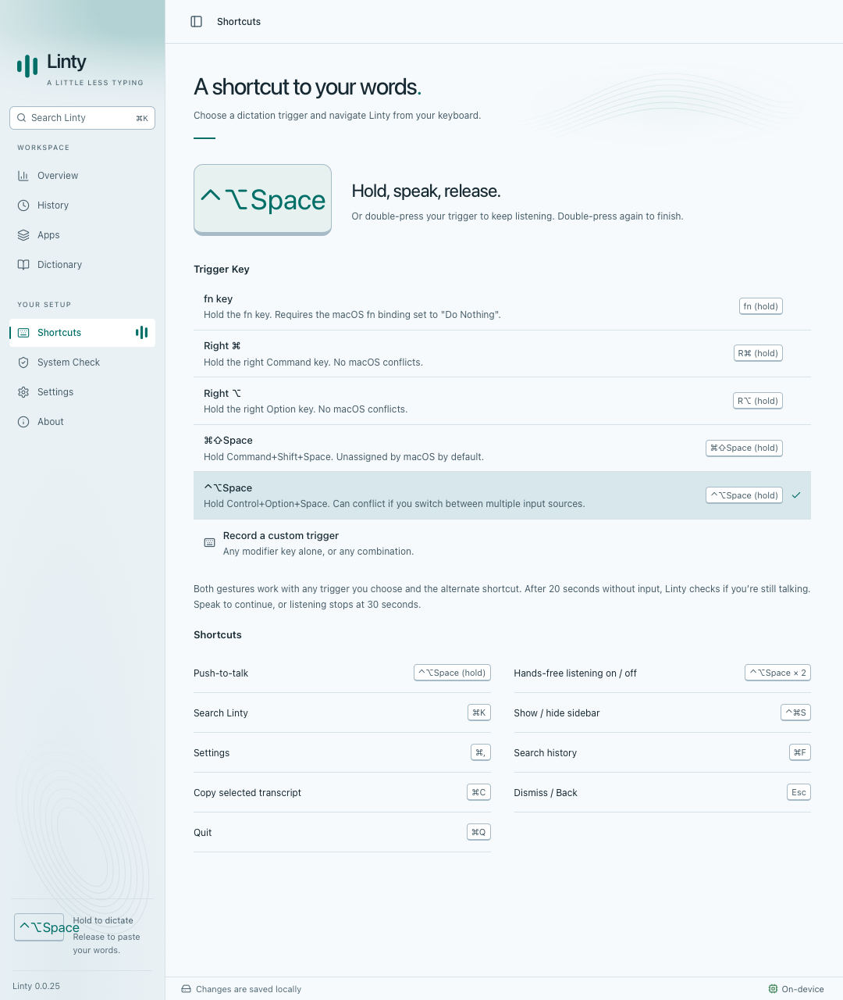
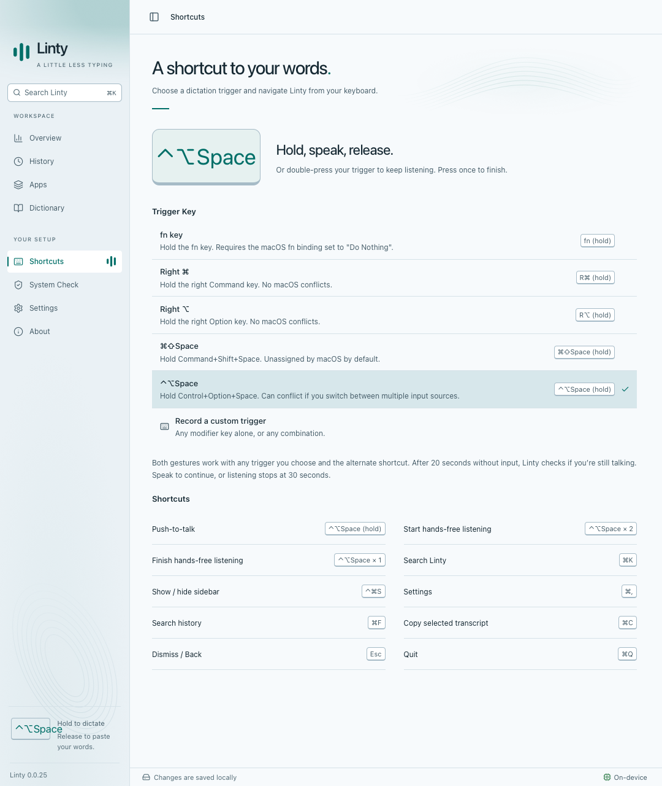

# Hands-free finishing and onboarding language

Before screenshots use `9e94fb4`. After screenshots use the changes in this PR.
All captures use WebKit with synthetic Tauri fixtures, in both themes. They do
not contain customer transcripts or credentials.

## Behavior

- Double-press any configured trigger to lock listening; press either registered
  trigger once to finish. Hold/release still works. A trailing tap within 400 ms
  cannot open another recording, including after a fast result or cancelled startup.
- New setup goes from Welcome to Dictation language, then Microphone. Previously
  it went straight to Microphone. English is preselected for a fresh installation.
- Continue persists the language before advancing. A failed save leaves the
  choice available to retry. Existing saved choices, including auto-detect, remain
  intact; completed installations without a saved language keep auto-detect.
- Permission recovery bypasses the new step. Model downloads continue during
  setup, and progress counts include the added screen.
- The picker uses the current supported language catalog. App menus remain in
  English. Hindi/Hinglish feasibility is a separate discussion; no new speech
  models or language support are introduced here.

## Before and after

| Screen | Before | After |
| --- | --- | --- |
| Setup, dark |  |  |
| Setup, light |  |  |
| Shortcuts, dark |  |  |
| Shortcuts, light |  |  |

## Validation

- `yarn build`
- `yarn test` — 81 tests
- `yarn test:dictation` and `UI_BROWSER=webkit yarn test:dictation`
- `yarn test:onboarding` and `UI_BROWSER=webkit yarn test:onboarding`
- `yarn test:recovery`
- `yarn test:ui` — both themes, accessibility and minimum window coverage
- `git diff --check`

Browser tests simulate native shortcut events, microphone startup and store
writes. This follow-up changes no Rust code; physical microphone and macOS
global-key behavior were not manually retested.
