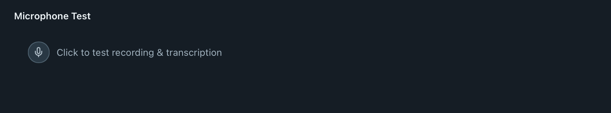
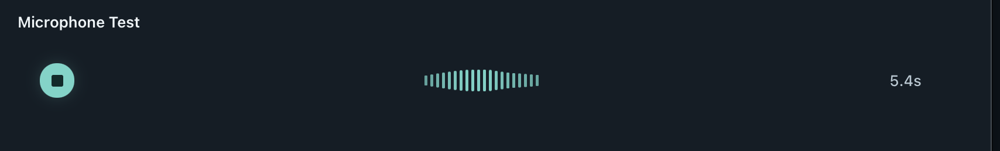
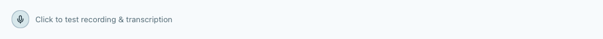

# Dictation motion and microphone feedback review

Listening now contracts from a 234 × 40 px pill to a centered 40 × 40 px
processing circle. The brand mark fades into a continuous processing arc, then
a checkmark before dismissal. The same shell stays mounted through each phase;
fast results and new recordings can interrupt the transition safely. Transcript
text stays out of the pill. A failed paste produces an error instead of a success
check or sound.

Both the pill and the in-app Microphone Test use the same calmer 19-bar input
history. Quiet noise stays near the 2 px baseline, ordinary input uses the middle
of the 20 px height, and emphasis retains headroom. The microphone test no longer
generates a timed center bulge. Repeated silence clears the history, and leaving
the test removes its level listener without stopping an active recording.
These changes affect the visual response, not capture gain or the inactivity guard.

The translucent pill can be repositioned only while hands-free listening is
locked through a configured trigger's double press. Hold-to-talk, processing,
and success cannot start a drag. Position persists across dictations and app
restarts, is clamped to a connected display's work area, and falls back to the
main display when its previous screen is removed.

## Microphone Test: supplied screenshots and updated UI

The before images below are the original screenshots supplied for this change,
copied without editing. The after images are WebKit captures of the actual app
widget with synthetic input. They show the visual behavior, not an audio-matched
comparison with the original screenshots. Different screenshot scales reflect
the original capture dimensions.

| State | Before (original screenshot) | After (dark) |
| --- | --- | --- |
| Idle |  |  |
| Listening |  |  |

| Updated light theme | Screenshot |
| --- | --- |
| Idle |  |
| Listening |  |

## Pill: before and after

Baseline pill captures come from commit `eb6d7f6` (PR #63). The listening
captures use the same synthetic phrase; the new response leaves more vertical
headroom. Browser captures use a plain backdrop rather than a native desktop.

| State | Before (dark) | After (dark) |
| --- | --- | --- |
| Listening |  |  |
| Processing |  |  |
| Success |  |  |

| State | Before (light) | After (light) |
| --- | --- | --- |
| Listening |  |  |
| Processing |  |  |
| Success |  |  |

Mid-transition captures show the continuous contraction, rather than a jump
between the listening and processing endpoints:

| Dark | Light |
| --- | --- |
|  |  |

To review the actual motion, run `yarn dev` and open
`/tests/previews/pill-motion-preview.html`. It renders the real component with
quiet-room, noise, soft-speech, conversation, and emphasis presets, state controls,
hands-free-only dragging, and optional local microphone metering. Microphone
tracks and the audio context are released on stop, processing, or tab suspension.

## Review and validation

Review covered animation continuity, center geometry, reduced motion and
transparency, inaccessible outgoing controls, fast/failed completion, microphone
history and listener cleanup, drag eligibility, native placement restoration,
display removal, and delayed preview microphone permissions. A failed position
save now restores the previous stored value so the next hide can retry it.
No blocking findings remain from this code review.

- `yarn build`: generated assets, TypeScript, and production bundle passed.
- `yarn test`: 79 tests passed.
- `yarn test:dictation`: passed in Chromium and WebKit, including the in-app
  microphone test, both themes, reduced motion, and accessibility checks.
- `yarn test:motion`: passed in Chromium and WebKit.
- `node tests/ui.pill-preview.mjs`: passed in Chromium and WebKit.
- `yarn test:recovery`: passed in Chromium.
- `cargo test --manifest-path src-tauri/Cargo.toml --no-default-features --lib`:
  56 passed, including the three placement cases; one test requiring installed
  S1-mini assets was ignored.
- `cargo check --manifest-path src-tauri/Cargo.toml --features local-stt,parakeet --lib`:
  production-feature compilation passed.
- Rust logging hygiene and `git diff --check`: passed.

UI tests use synthetic microphone frames and mocked Tauri IPC. Physical
microphone input, native window dragging/focus, and desktop compositing were not
tested in a packaged app during this review.
