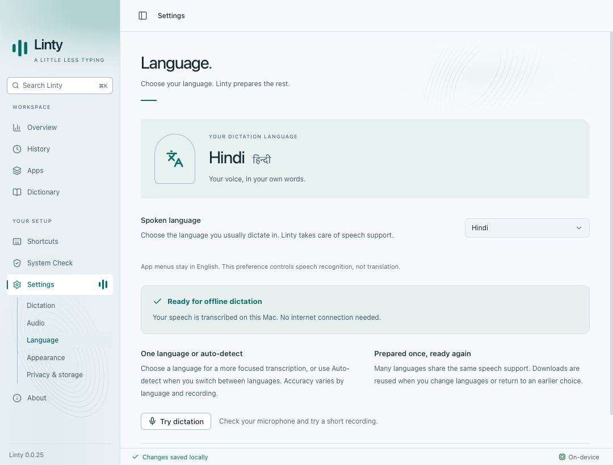
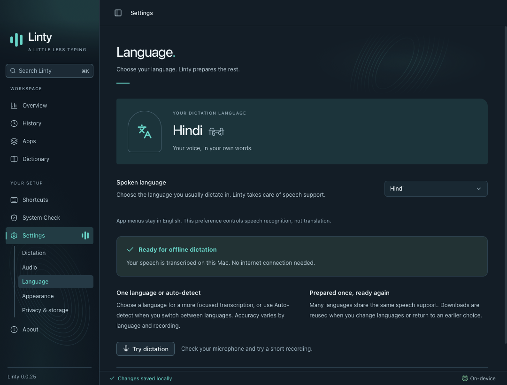

# Language-led, on-device dictation

The Language page replaces Speech engine settings. Selecting a language prepares its local model during onboarding and later changes. Downloads are reused; failed preparation can be retried; activation waits for dictation to finish.

Speech recognition and optional cleanup run on the Mac. Retired preferences and credentials are deleted on upgrade. Existing transcripts and their original metadata remain available.

Screenshots use synthetic data and the mocked native bridge in Playwright WebKit at 1080 × 820. No personal history or audio is included. The website screenshots are separately reproduced with `scripts/capture-website.mjs` at 1200 × 800 and 2× scale.

