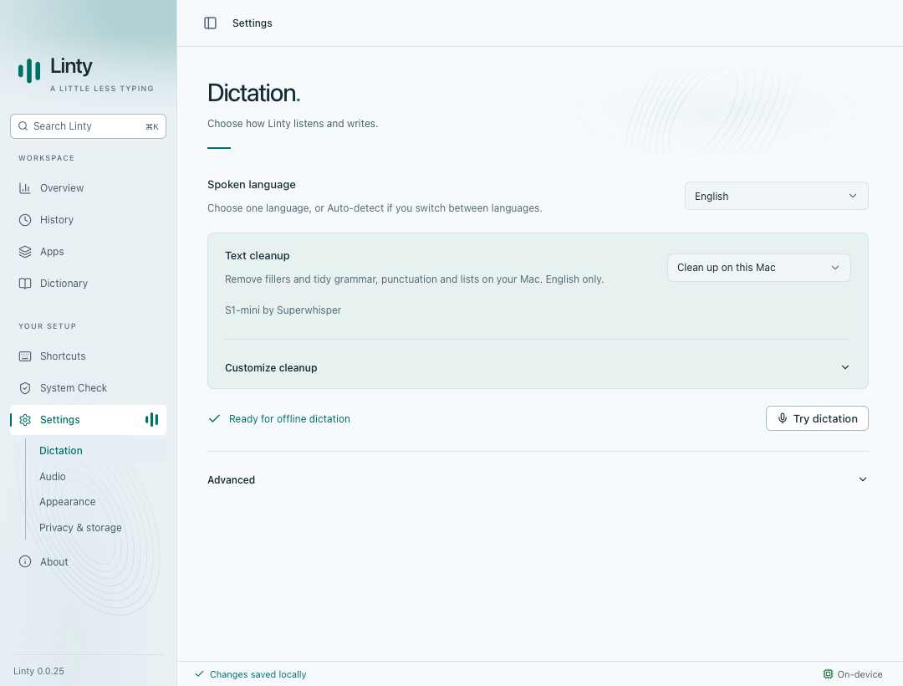
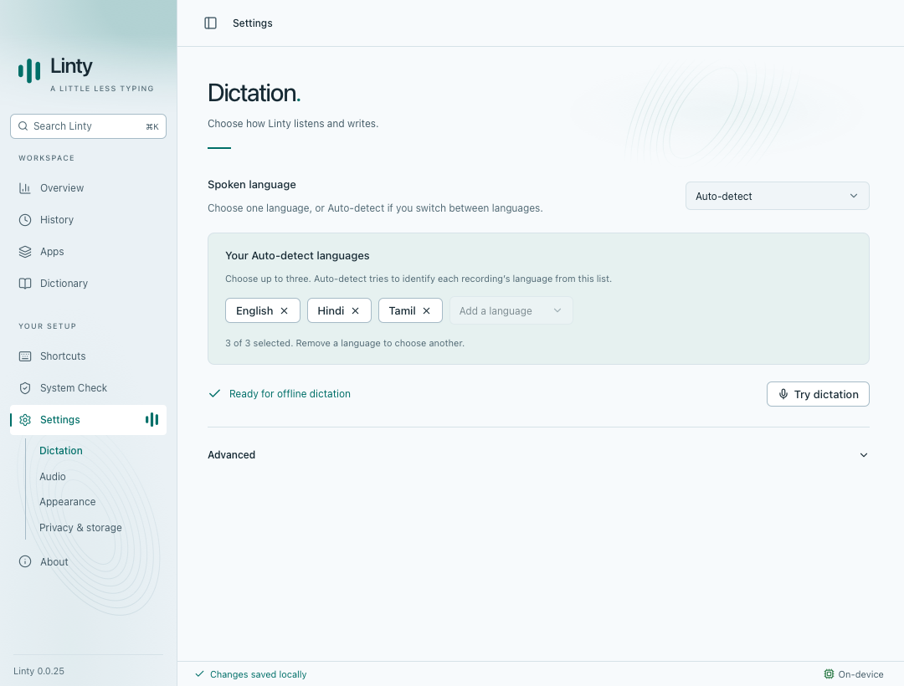
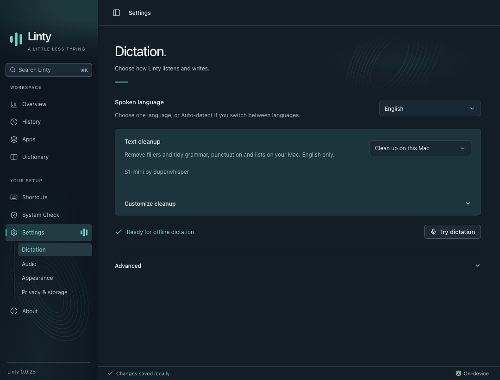
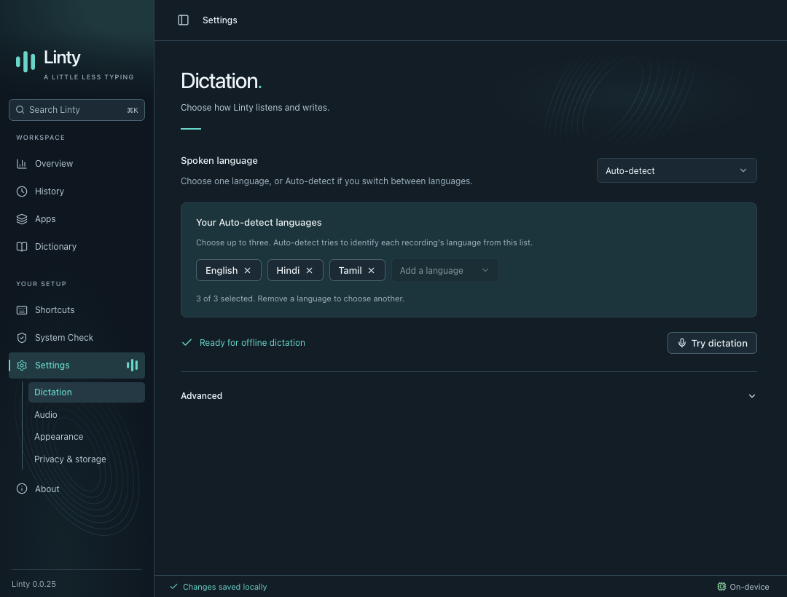

# Unified Dictation settings

Captured with synthetic fixtures in WebKit at 1080 × 820. The fixture version in the sidebar is not the release version.

Language and cleanup share one page. English shows its cleanup controls in the contextual box; Auto-detect shows the saved list of up to three languages there. Other languages show neither group. Memory and speech model details are under Advanced.

Selecting English prepares and enables cleanup automatically, downloading S1-mini once when needed. Selecting another language, including Auto-detect, saves cleanup as off. Failed preparation or persistence preserves the confirmed language and cleanup pair. Late English downloads cannot overwrite a subsequent selection. A manual English opt-out survives startup; selecting English again applies its automatic default.

| English | Auto-detect |
| --- | --- |
|  |  |
|  |  |

Validation: production build; 137 Node tests; 120 native tests passed, with four existing ignored tests; Chromium smoke, onboarding/language, and cleanup suites; WebKit onboarding/language suite. Browser coverage includes both themes, accessibility, the 640 × 480 minimum window, language-dependent visibility, persistence failures, setup retry, stale downloads, navigation, and native cleanup options.
