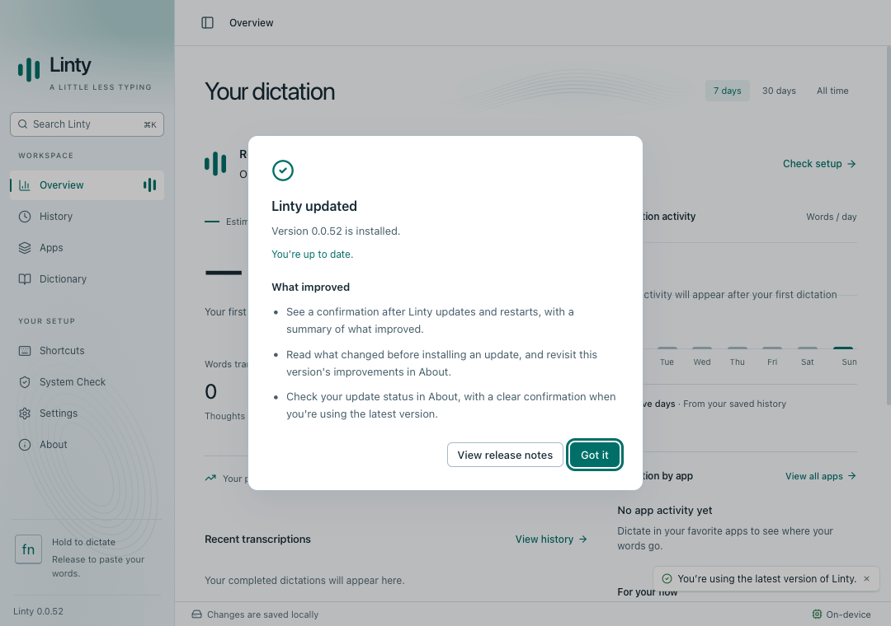
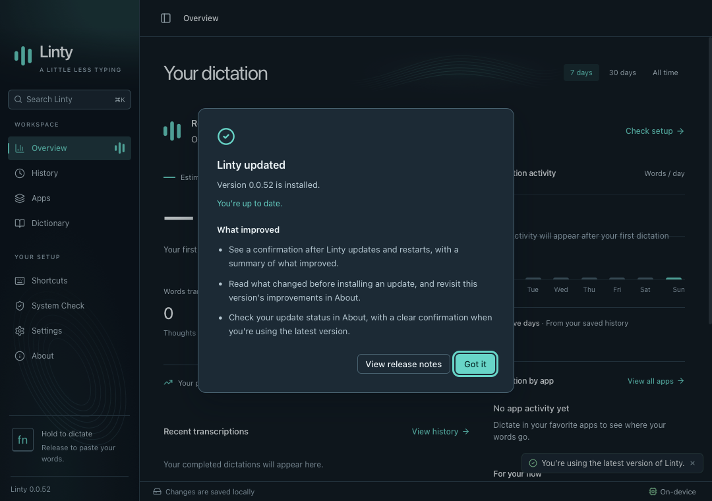

# Update acknowledgment

Synthetic WebKit screenshots of the post-update acknowledgment in light and dark themes. The fixture simulates upgrading to the source version; the release workflow assigns the production version when building.

`yarn test:updates` covers optional and required update installation and relaunch, failed installation, offline checks, fresh installations, migration from installations without version tracking, acknowledgment persistence and save failures, keyboard focus, accessibility, and the minimum 640 × 480 window. Run with `UI_BROWSER=webkit` for the macOS webview engine. The checks workflow runs both Chromium and WebKit.
