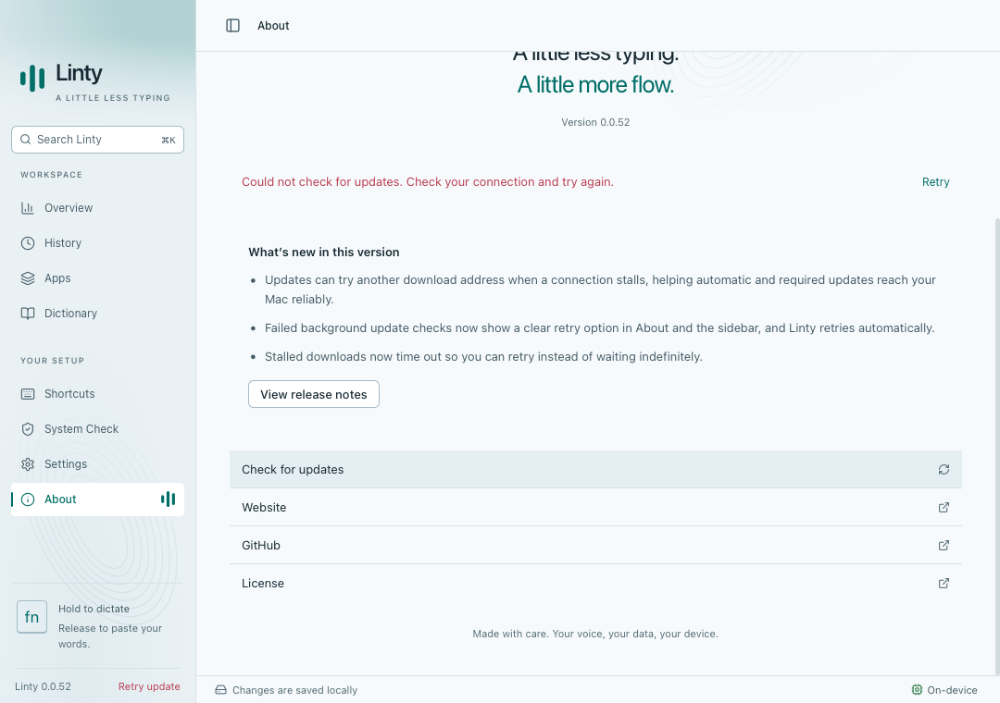
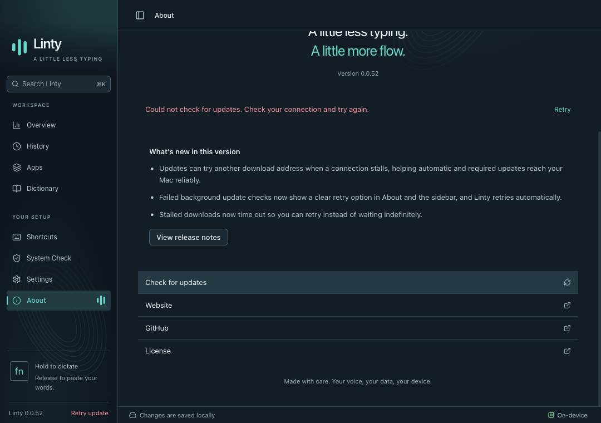

# Update connection recovery

Synthetic WebKit screenshots of the existing About error state and sidebar retry action, now also shown when a background check fails. Source builds display the source version; the release workflow assigns the production version.

`yarn test:updates` verifies that a failed startup check stays visible, retries after one minute, backs off after another failure, and clears the error when connectivity recovers. The suite runs in Chromium and WebKit alongside required-update installation, release notes, and restart acknowledgment coverage.
