# Telemetry privacy flow

Twelve captures of the app UI in WebKit, using synthetic empty history and
simulated Tauri responses. PostHog is simulated as configured so the choices are
visible; no project token, real customer data, or live ingestion is used. These
are frontend screenshots, not native macOS permission dialogs. Native consent,
queue, and installation-ID behavior is covered separately by the Rust tests.

## 1. Setup offers one preselected choice

The last setup screen explains **Share telemetry** and says nothing is sent
before confirmation. Keeping it on and selecting **Try dictation** confirms the
choice. The expandable disclosure explains the random installation ID and the
data exclusions.

| Light | Dark |
| --- | --- |
| 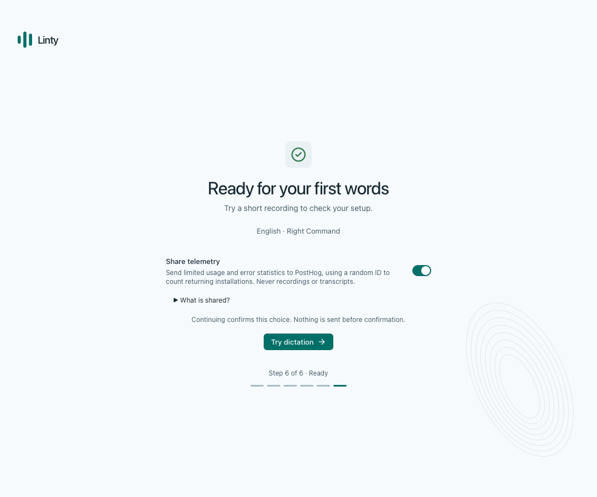 | 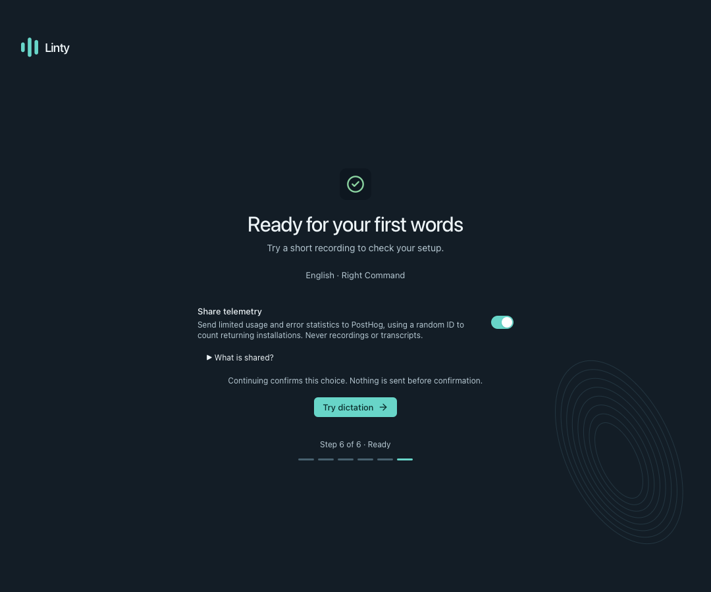 |

## 2. Setup also works with sharing off

Customers can switch sharing off before continuing. The same **Try dictation**
action saves that off choice and completes setup. The capture run verified that
this route saves `enabled: false` and produces no telemetry IPC events.

| Light | Dark |
| --- | --- |
| 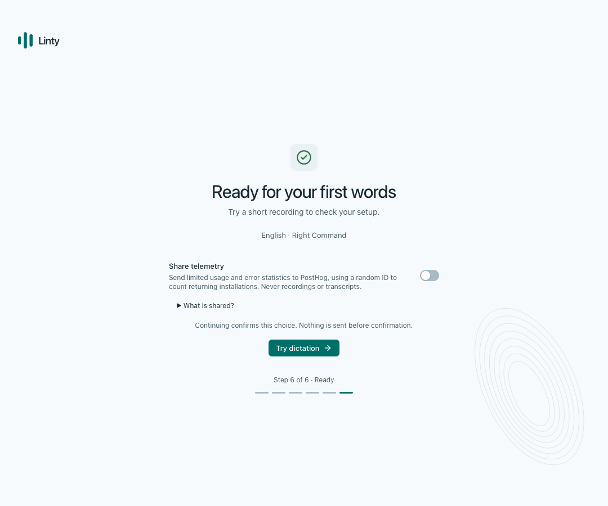 | 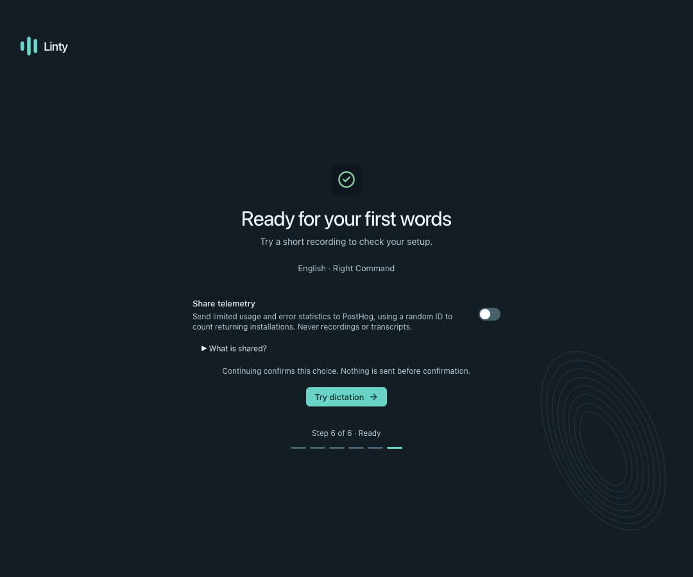 |

## 3. Existing customers see one heads-up for this new collection

An installation without a saved telemetry choice sees **Help improve Linty**.
The switch is preselected, but no events are collected before **Confirm
preference**. Customers can switch it off before confirming. Ordinary upgrades
keep a saved choice and do not show this prompt again.

| Light | Dark |
| --- | --- |
| 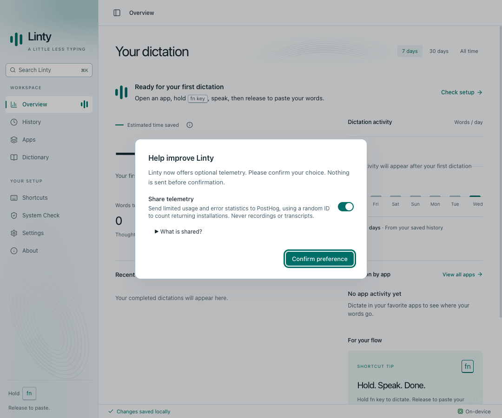 | 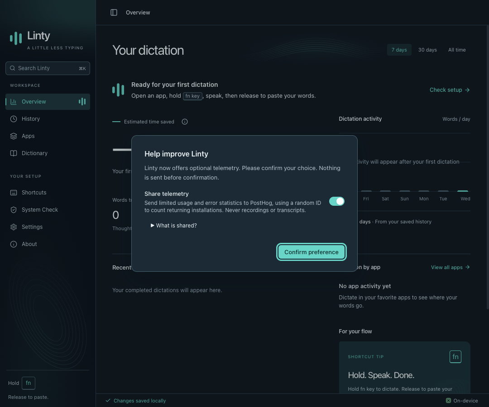 |

## 4. Settings explains what is shared

**Settings → Privacy & storage → Share telemetry → What is shared?** lists the
metrics, linkability of the random ID, exclusions, provider connection metadata,
and the native crash-reporting limitation. This is one switch for usage and
fixed technical failure categories.

| Light | Dark |
| --- | --- |
| 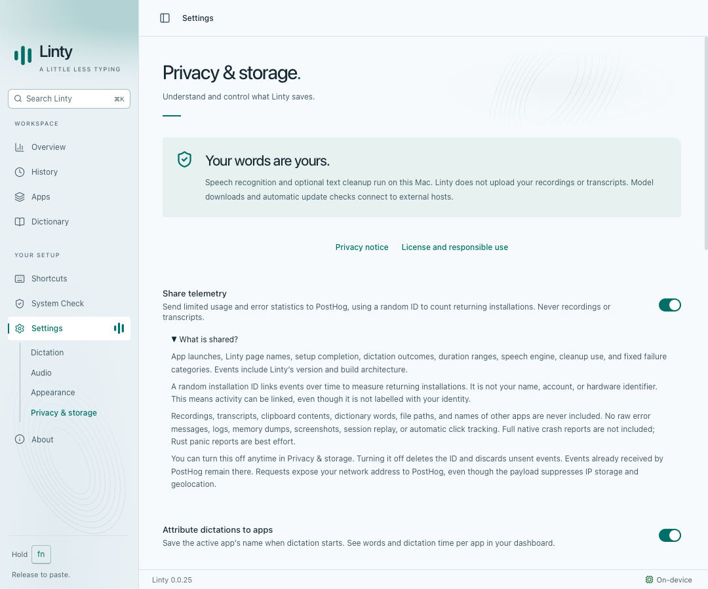 | 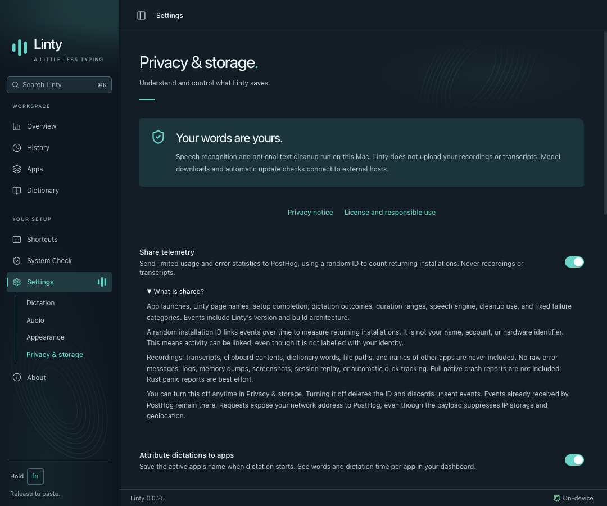 |

## 5. Customers can turn sharing off later

Switching it off in Settings saves the choice immediately. Rust stops collection,
removes the local installation ID, discards queued events, and cancels pending
HTTP work where possible. Received events cannot be recalled. The capture run
verified the saved off state and that a subsequent simulated interface error
produced no telemetry IPC event. Other local-history preferences remain separate.

| Light | Dark |
| --- | --- |
| 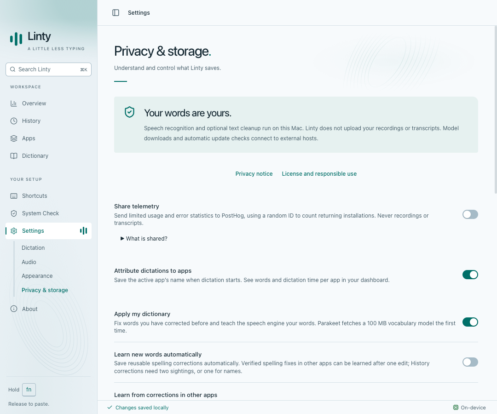 | 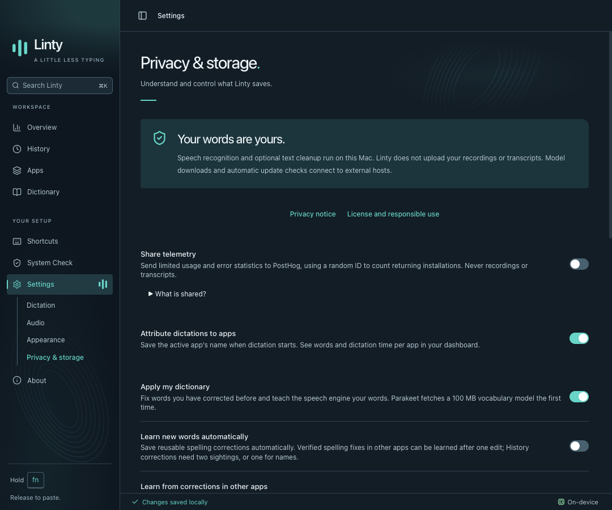 |

## 6. The full privacy notice is available offline

The **Privacy notice** opens inside Linty. Its **Optional telemetry** section
describes the confirmation flow, collected fields, persistent random ID, provider
processing, and opt-out limits. Reading the notice makes no network request.

| Light | Dark |
| --- | --- |
| 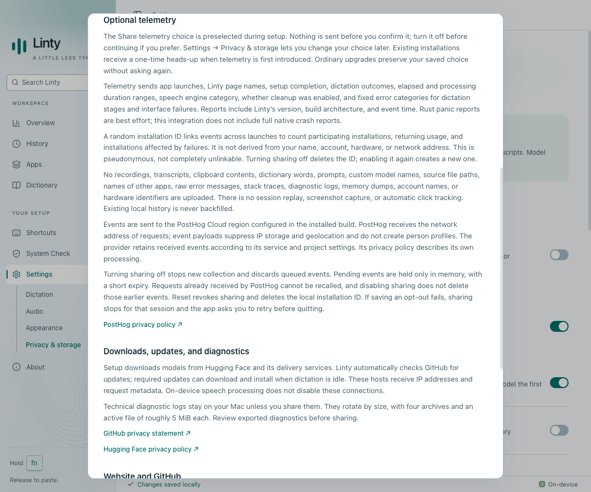 | 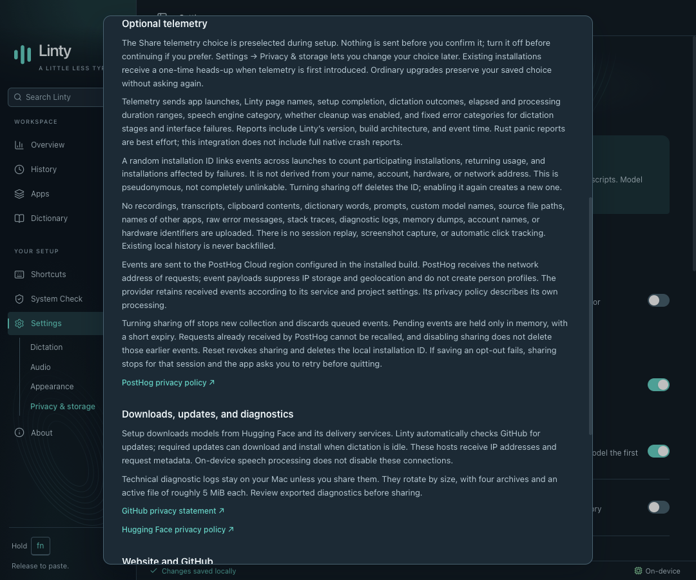 |

## Verification

Captured at 1080 × 900 in both themes with reduced motion. All twelve images were
inspected for legibility and clipping. The capture run verified the setup and
opt-out states, reported no page errors, and blocked and asserted zero external
requests.

See [the telemetry contract](../../../TELEMETRY.md) for event definitions,
questions the dashboard can answer, configuration, and verification limits.
